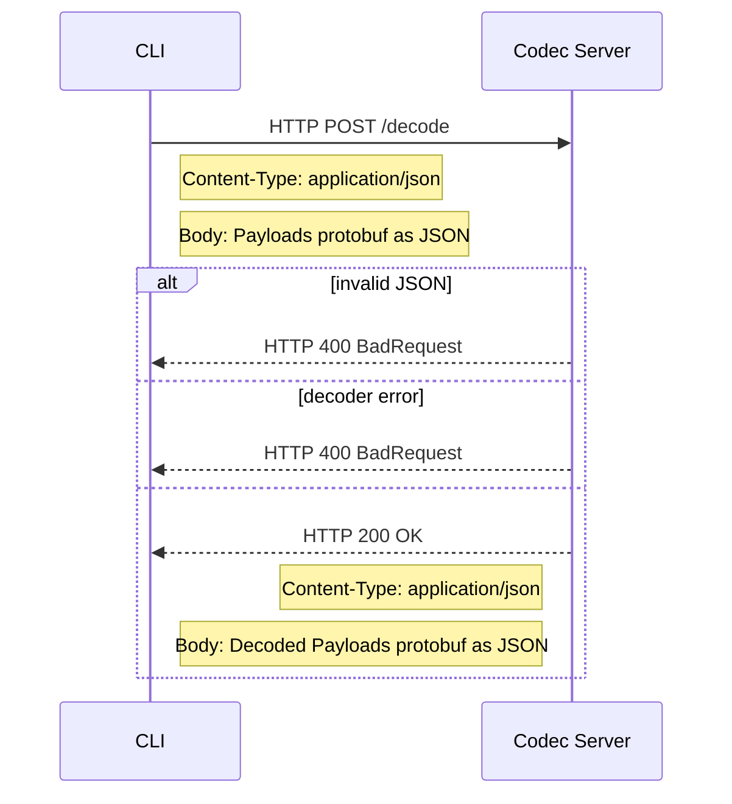

### Steps to run this sample:

This sample shows how to decode payloads that have been encoded by a codec so they can be displayed by the Temporal CLI and Temporal UI.
The sample codec server supports OIDC authentication (via JWT in the Authorization header).
Temporal UI can be configured to pass the user's OIDC access token to the codec server, see: https://docs.temporal.io/references/web-ui-configuration#auth
Configuring OIDC is outside the scope of this sample, but please see the [serverjwtauth repo](../serverjwtauth/) for more details about authentication.

1) Run a [Temporal service](https://github.com/temporalio/samples-go/tree/main/#how-to-use).
2) Run the following command to start the worker
   ```
   go run worker/main.go
   ```
3) Run the following command to start the example
   ```
   go run starter/main.go
   ```
4) Run the following command and see that the CLI cannot display the payloads as they are encoded (compressed)
   ```
   temporal workflow show -w codecserver_workflowID
   ```
5) Run the following command to start the remote codec server.
   The `-web` flag is needed for Temporal UI for CORS.
   ```
   go run ./codec-server -web=http://localhost:8080
   ```
6) Run the following command to see that the CLI can now decode (uncompress) the payloads via the remote codec server
   ```
   temporal workflow show -w codecserver_workflowID --codec-endpoint http://localhost:8081/{namespace}
   ```

# Codec Server Protocol

## Summary

This document outlines the HTTP protocol for codec servers. This functionality allows users to deploy a codec centrally rather than the previous architecture that required a `tctl` plugin on developer workstations. This makes it easier to secure access to any required encryption keys and simplifies the developer experience.

## Protocol

The codec HTTP protocol specifies two endpoints, one for encoding a Payloads object and one for decoding.

Implementations MUST:

1. Send and receive [Payloads](https://github.com/temporalio/api/blob/e82978c745a07fb8820348ad77b1d02e226d182e/temporal/api/common/v1/message.proto#L46) protobuf as JSON per [https://developers.google.com/protocol-buffers/docs/proto3#json](https://developers.google.com/protocol-buffers/docs/proto3#json).
Implementations should not rely on the standard JSON encoding of objects in their language but must use Protobuf specific JSON encoders. Libraries are available to handle this for most languages.
2. Only check the final part of the incoming URL to determine if the request is for /encode or /decode.
This makes deployment more flexible by allowing the endpoints to be mounted at any depth in a URL hierarchy, for example to allow encoders for different namespaces to be served from the same hostname.

Implementations MAY:

1. Support codec for different namespaces under different URLs.
2. Read the `X-Namespace` header sent to the /encode or /decode endpoints as an alternative to differentiating namespaces based on URL. The current CLI and Temporal UI codec client code will set `X-Namespace` appropriately for each request.

In the endpoint sequence diagrams below we are using the CLI as an example of the client side, but Temporal UI and all other consumers will follow the same protocol.

### Encode


### Decode


