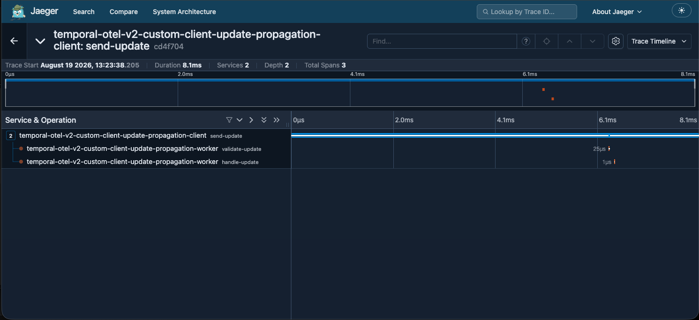

## Client-to-Update propagation

This sample creates a custom span on the client and then initiates an Update, propagating the trace through to the Workflow.

### Run the sample

1. Run a [Temporal Service](https://github.com/temporalio/samples-go/tree/main/#how-to-use).

2. Start Jaeger from the repository root:

```bash
docker compose -f opentelemetry-v2/docker-compose.yaml up -d
```

3. Start the Worker:

```bash
go run opentelemetry-v2/client-update-propagation/worker/main.go
```

4. In another terminal, start the Workflow and send the Update:

```bash
go run opentelemetry-v2/client-update-propagation/starter/main.go
```

5. Inspect the `temporal-otel-v2-custom-client-update-propagation-client`
   service in the [Jaeger UI](http://127.0.0.1:16686). The `send-update`,
   `validate-update`, and `handle-update` spans show custom span context
   propagation from the Client to the Workflow Update.

   
