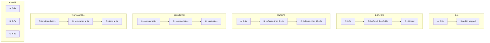
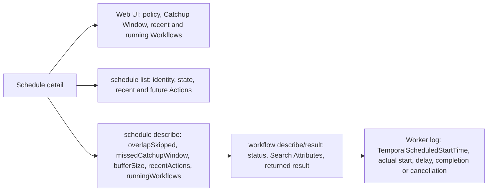

# Schedule Overlap Policy behavior

This experiment makes each Overlap Policy visible. The Schedule has an Action every 2 seconds, while each Workflow Execution stays open for 5 seconds. Every Action after the first therefore collides with a running Workflow Execution.

## Run the experiment

Start a development Service and the Worker in separate terminals:

```bash
temporal server start-dev --db-filename /tmp/temporal-overlap-policy.db
go run ./schedule/overlap/worker
```

Create one demo Schedule from another terminal:

```bash
go run ./schedule/overlap/starter skip
```

Replace `skip` with `buffer-one`, `buffer-all`, `cancel-other`, `terminate-other`, or `allow-all`. Pass an optional Catchup Window in seconds after the policy; it defaults to the minimum value of 10:

```bash
go run ./schedule/overlap/starter allow-all 30
```

Let the Schedule run for 15 to 20 seconds, then delete it before trying the next policy:

```bash
temporal schedule delete --schedule-id schedule-overlap-skip
```

## Expected timelines

`A`, `B`, and `C` are Actions scheduled at 0, 2, and 4 seconds. A solid arrow is a running Workflow Execution. A dotted arrow is an Action that waits in the buffer. A cross is an Action that is skipped or dropped.



The exact timestamps vary because interval Schedules align to the Unix epoch. The relationships between runs are stable.

## Choose a policy by desired behavior

| Desired behavior | Policy | Trade-off to check |
| --- | --- | --- |
| Do only fresh work and accept missed occurrences | `Skip` | `overlapSkipped` grows while a run is open. |
| Run once more after the current work, but coalesce repeated demand | `BufferOne` | The first waiting Action is kept; later ones are skipped. |
| Process every occurrence serially | `BufferAll` | Backlog and schedule-to-start delay can grow; Service buffer limits still apply. |
| Replace stale work after it cooperatively cleans up | `CancelOther` | The new run waits for cancellation to finish. Workflow code and Activities must handle cancellation promptly. |
| Replace stale work immediately | `TerminateOther` | Termination does not run Workflow cleanup code. Use it only when abrupt termination is safe. |
| Run every occurrence concurrently | `AllowAll` | The Workflow and downstream systems must tolerate concurrency. Last completion result and last failure are not chained between runs. |

## Observe the difference



The Worker logs `START`, `COMPLETE`, and `CANCELED` with Workflow and Run Ids. Each `START` line includes the `TemporalScheduledStartTime` Search Attribute, the actual start time, and their difference. That delay stays small for immediate starts and grows for buffered or recovered Actions. A terminated Workflow cannot write a final log line, which makes `TerminateOther` visibly different from `CancelOther`.

Open the [Schedules page in the Web UI](http://localhost:8233/namespaces/default/schedules), select the demo, and compare its recent and running Workflow Executions. Open the Workflows page with this query to see every execution started by the Schedule:

```text
TemporalScheduledById="schedule-overlap-skip"
```

The CLI exposes the same state:

```bash
temporal schedule list
temporal schedule describe --schedule-id schedule-overlap-skip
temporal schedule describe --schedule-id schedule-overlap-skip --output json
```

In the description, compare `overlapSkipped`, `bufferDropped`, `bufferSize`, `runningWorkflows`, and `recentActions`. Zero-valued counters can be omitted from JSON output. Use a Workflow Id and Run Id from `recentActions` to inspect the execution and its returned string:

```bash
temporal workflow describe --workflow-id <workflow-id> --run-id <run-id>
temporal workflow result --workflow-id <workflow-id> --run-id <run-id>
```

Expected status patterns:

- `Skip`: fewer Workflow Executions than scheduled Action times; completed runs.
- `BufferOne`: completed runs plus at most one waiting Action; `overlapSkipped` grows under sustained overlap.
- `BufferAll`: completed or running Workflows start one at a time; `bufferSize` grows while arrivals outpace completions.
- `CancelOther`: canceled runs followed by replacements.
- `TerminateOther`: terminated runs followed immediately by replacements.
- `AllowAll`: several running Workflow Executions at once.

## Exercise the Catchup Window

The sample defaults to a 10-second Catchup Window, the minimum supported value. Change it with the optional `catchup-seconds` argument. This window applies when the Temporal Service cannot process automatically scheduled Actions. It does not limit explicit Backfills or immediate triggers.

Use `allow-all` to keep overlap behavior from hiding the recovery burst:

1. Create `schedule-overlap-allow-all` and wait for a completed run.
2. Stop the development Service, but leave the Worker running.
3. Wait at least 15 seconds.
4. Restart the Service with the same `--db-filename` command.
5. Describe the Schedule again.

Actions less than 10 seconds late are started after recovery. Older Actions are discarded, and `missedCatchupWindow` increases. With `AllowAll`, the eligible Actions can appear as a concurrent burst. A longer Catchup Window recovers more work but can create a larger burst or backlog; a shorter window favors freshness but intentionally loses older Actions.
