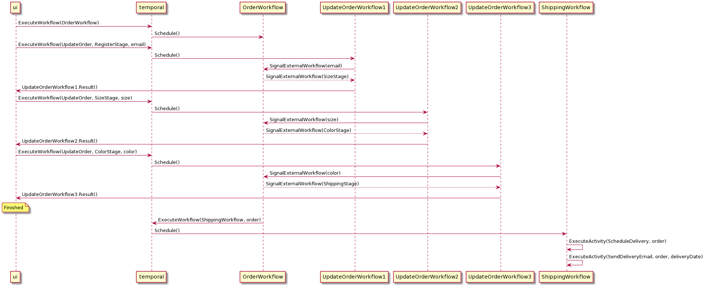

## Synchronous Proxy Sample

This sample demonstrates how to achieve synchronous interaction with a main workflow.

We call this pattern a proxy workflow. The proxy workflow sends a signal to the main workflow and then blocks waiting for a signal in response.

This mimics a synchronous SendAndReceiveSignal feature which Temporal does not currently provide natively.

The flow of calls is outlined in the diagram below.



### Steps to run this sample:

1) You need a Temporal service running. See details in README.md
2) Run the following command to start the worker
```shell
go run worker/main.go
```
3) Run the following command to start the simple UI
```shell
go run ui/main.go
```

Once the UI has exited you will be able to see delivery details in the worker output, as might have been emailed to you in a real implementation.
